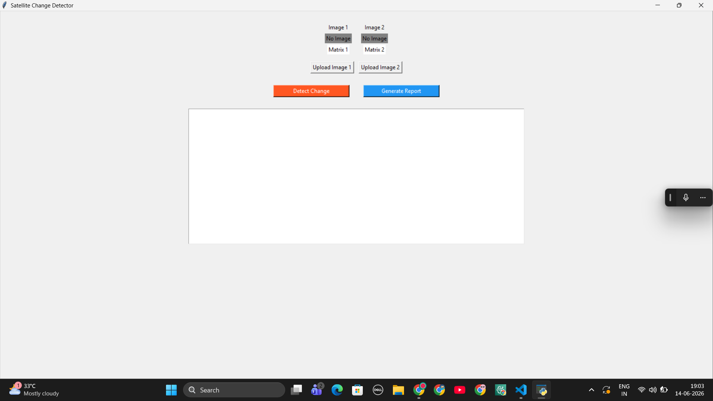
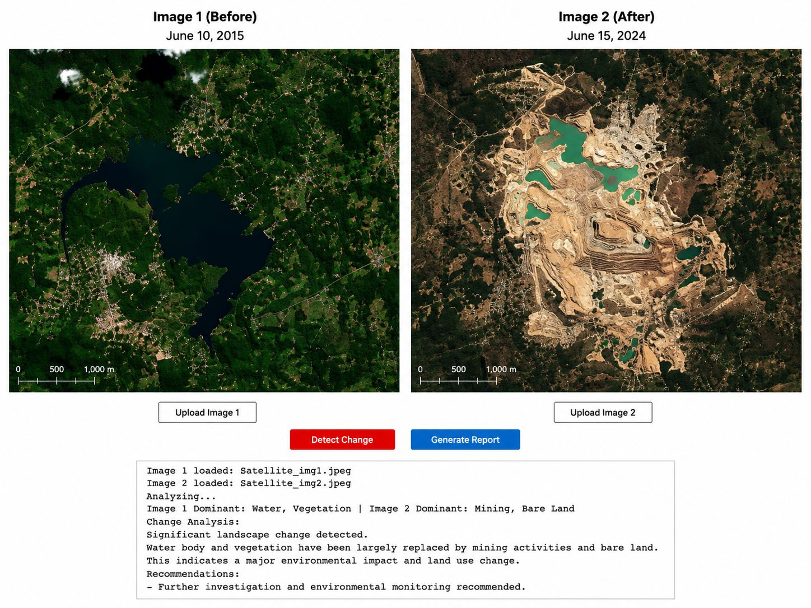

# DeepLandScope: A DeepLabV3-ResNet50 Powered Geospatial Intelligence Platform for Landscape Change Detection and Environmental Impact Assessment

> **AI-powered satellite image change detection using DeepLabV3-ResNet50 semantic segmentation, automated land-cover analysis, environmental impact assessment, and intelligent report generation.**

---

## 🌍 Overview

**DeepLandScope AI** is an advanced Deep Learning-based satellite image analysis system designed to detect, analyze, and explain landscape transformations across time.

The system leverages **DeepLabV3-ResNet50 Semantic Segmentation** to classify land-cover categories from satellite imagery and automatically identify significant environmental changes such as:

* 🌳 Deforestation
* 🏙 Urban Expansion
* 🚜 Agricultural Conversion
* 💧 Water Body Reduction
* 🌊 Flood Formation
* 🏜 Land Degradation
* ⛏ Mining Activities

Beyond simple change detection, the application generates **human-readable environmental reports and recommendations**, making the results understandable for researchers, environmentalists, policymakers, and disaster management teams.

---

# 🎯 Problem Statement

Satellite imagery contains valuable information about environmental and land-use changes.

However:

* Manual interpretation is time-consuming
* Large-scale monitoring is difficult
* Environmental impacts are often identified too late
* Non-technical users struggle to understand satellite imagery

DeepLandScope AI solves these challenges by combining:

✅ Deep Learning

✅ Semantic Segmentation

✅ Land Cover Classification

✅ Change Detection

✅ Automated Environmental Reporting

---

# 🧠 AI Model Used

## DeepLabV3 + ResNet50

```python
models.segmentation.deeplabv3_resnet50(pretrained=True)
```

### Why DeepLabV3?

DeepLabV3 is one of the most powerful Semantic Segmentation architectures available.

Features:

* Atrous (Dilated) Convolutions
* Multi-scale Context Aggregation
* Pixel-Level Classification
* High Accuracy Segmentation
* Robust Feature Extraction

### Backbone Network

**ResNet50**

* 50-layer Deep Residual Neural Network
* Prevents vanishing gradients
* Excellent feature extraction capabilities
* Pretrained on large-scale datasets

---

# 🔬 Technologies Used

| Technology      | Purpose                 |
| --------------- | ----------------------- |
| Python          | Core Development        |
| PyTorch         | Deep Learning Framework |
| DeepLabV3       | Semantic Segmentation   |
| ResNet50        | Feature Extraction      |
| NumPy           | Matrix Operations       |
| Pillow (PIL)    | Image Processing        |
| Tkinter         | Desktop GUI             |
| python-docx     | Report Generation       |
| NLP Rule Engine | Environmental Insights  |

---

# 🏗 System Architecture

```text
Satellite Image 1
        │
        ▼
DeepLabV3-ResNet50
        │
        ▼
Land Cover Classification
        │
        ▼
Class Mapping
(Agriculture / Forest / Water /
 Urban / Barren Land)
        │
        ▼
Class Distribution Analysis
        │
        ▼
Satellite Image 2
        │
        ▼
DeepLabV3-ResNet50
        │
        ▼
Change Detection Engine
        │
        ▼
NLP Analysis Engine
        │
        ▼
Environmental Report Generation
```

---

# 🌱 Land Cover Classes

The segmentation output is mapped into custom environmental categories:

| Original Class | Mapped Class |
| -------------- | ------------ |
| Grass          | Agriculture  |
| Field          | Agriculture  |
| Tree           | Forest       |
| Plant          | Forest       |
| Water          | Water        |
| Building       | Urban        |
| Road           | Urban        |
| Earth          | Barren Land  |
| Soil           | Barren Land  |

Final Classes:

```text
Agriculture
Forest
Water
Urban
BarrenLand
```

---

# ✨ Key Features

## 📸 Dual Satellite Image Upload

Upload two satellite images captured at different time periods.

---

## 🧠 Deep Learning-Based Segmentation

Uses DeepLabV3-ResNet50 to perform semantic segmentation and classify every pixel.

---

## 🌍 Landscape Change Detection

Detects transitions such as:

* Forest → Agriculture
* Agriculture → Urban
* Water → Barren Land
* Barren Land → Water

---

## 🎨 Color-Coded Segmentation Maps

Visual representation of classified regions.

| Class       | Color       |
| ----------- | ----------- |
| Agriculture | Light Green |
| Forest      | Dark Green  |
| Water       | Blue        |
| Urban       | Orange      |
| Barren Land | Brown       |

---

## 📝 Intelligent NLP Analysis

Generates human-readable insights.

Example:

```text
Significant change detected:
Water → Barren Land

Water body drying observed,
possibly due to drought or diversion.

Recommendations:
• Conduct ground validation
• Implement water conservation measures
• Monitor environmental impact
```

---

## 📄 Automated Report Generation

Exports detailed reports in DOCX format containing:

* Image Details
* Dominant Land Cover
* Class Distribution
* Change Analysis
* Environmental Recommendations

---

# 🖥 Application Interface


## Application Demo


```

---

# 📊 Example Result

### Input

**Image 1 (2015)**

* Dense vegetation
* Large water reservoir

**Image 2 (2024)**

* Open-pit mining activities
* Significant land degradation
* Reduced vegetation

### AI Output

```text
Image 1 Dominant:
Water, Vegetation

Image 2 Dominant:
Mining, Bare Land

Change Analysis:

Significant landscape change detected.

Water body and vegetation have been largely replaced by mining activities and bare land.

This indicates major environmental impact and land-use transformation.

Recommendations:
- Conduct environmental monitoring
- Assess biodiversity loss
- Implement restoration measures
```

---

# 📈 Sample Workflow

```text
Upload Image 1
        │
Upload Image 2
        │
Detect Change
        │
Semantic Segmentation
        │
Land Cover Analysis
        │
Environmental Impact Assessment
        │
Generate Report
```

---

# ⚡ Installation

Clone Repository

```bash
git clone https://github.com/yourusername/DeepLandScope-AI.git
cd DeepLandScope-AI
```

Install Dependencies

```bash
pip install -r requirements.txt
```

Run Application

```bash
python app.py
```

---

# 📂 Project Structure

```text
DeepLandScope-AI/
│
├── app.py
│
├── model/
│   └── landcover_model.py
│
├── utils/
│   ├── nlp_utils.py
│   └── postprocess.py
│
├── images/
│
├── assets/
│   └── interface_demo.png
│
├── requirements.txt
│
└── README.md
```

---

# 🚀 Future Enhancements

* Real Satellite APIs Integration
* Google Earth Engine Support
* GIS Data Integration
* Change Heatmaps
* Time-Series Monitoring
* Web Dashboard Version
* Custom Model Fine-Tuning
* Explainable AI (XAI)
* Cloud Deployment
* Multi-Class Environmental Risk Prediction

---

# 🎓 Academic Contribution

This project demonstrates the practical application of:

* Deep Learning
* Computer Vision
* Semantic Segmentation
* Remote Sensing
* Environmental Informatics
* Land Use & Land Cover Analysis
* Automated Report Generation

---

# 🏆 Impact

DeepLandScope AI can assist:

🌍 Environmental Monitoring Agencies

🏛 Government Planning Authorities

🌳 Forest Conservation Departments

💧 Water Resource Management Teams

🚨 Disaster Response Organizations

🔬 Researchers & Students

---

# 👩‍💻 Author

**Suchitra Koyya**
B.Tech – Computer Science & Engineering (Data Science)
Deep Learning | Computer Vision | Remote Sensing | AI for Environmental Sustainability

---

## ⭐ If you found this project useful, consider giving it a Star!

**"Transforming Satellite Imagery into Actionable Environmental Intelligence using DeepLabV3-ResNet50 AI."** 🌎🚀
# Results



### Detected Change

Water & Vegetation ➜ Mining & Barren Land

The AI successfully identified significant environmental degradation and generated automated recommendations for further investigation.
```

